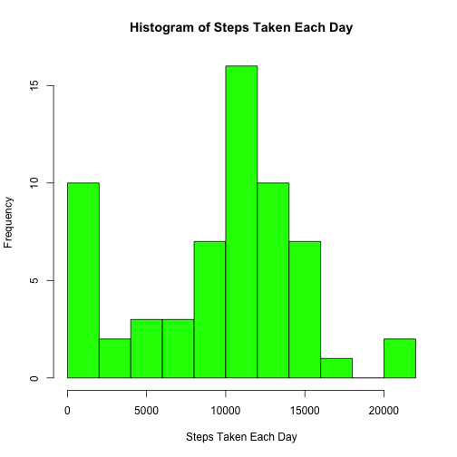
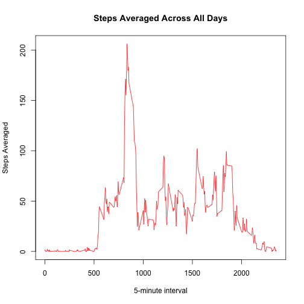
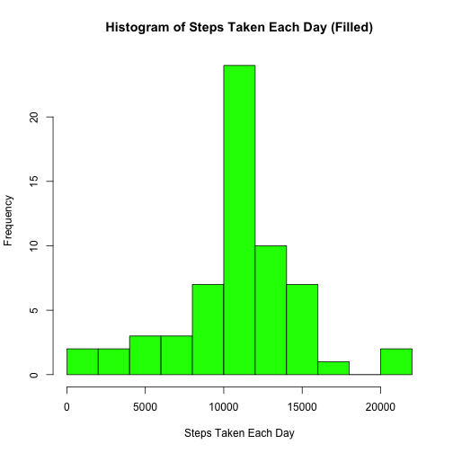
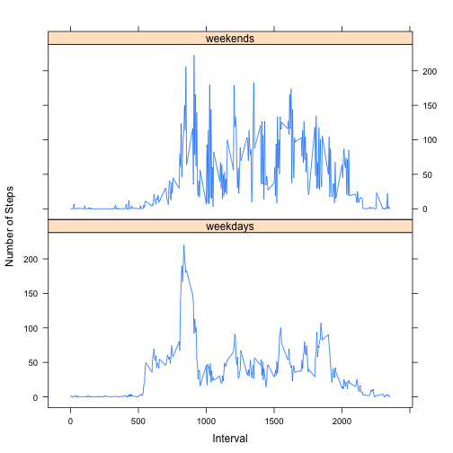

# Reproducible Research: Peer Assessment 1


### Loading and preprocessing the data


```r
csv_file <- unzip("repdata-data-activity.zip")
file <- read.csv(csv_file)
```


### What is mean total number of steps taken per day?
* 1. Make a histogram of the total number of steps taken each day


```r
step_sum <- with(file, tapply(steps, date, sum, na.rm = TRUE))  #by dates
hist(step_sum, breaks = 10, col = "green", main = "Histogram of Steps Taken Each Day", 
    xlab = "Steps Taken Each Day")
```

 


* 2. Calculate and report the mean and median total number of steps taken per day

```r
mean <- mean(step_sum)
median <- median(step_sum)
print(sprintf("Mean: %g", mean))
```

```
## [1] "Mean: 9354.23"
```

```r
print(sprintf("Median: %g", median))
```

```
## [1] "Median: 10395"
```


### What is the average daily activity pattern?

* 1. Make a time series plot (i.e. `type = "l"`) of the 5-minute interval (x-axis) and the average number of steps taken, averaged across all days (y-axis)

```r
stepMeans <- with(file, tapply(steps, interval, mean, na.rm = TRUE))  #by intervals
stepMeans <- as.numeric(stepMeans)
interval <- as.numeric(levels(factor(file$interval)))
plot(interval, stepMeans, type = "l", col = "red", xlab = "5-minute interval", 
    ylab = "Steps Averaged", main = "Steps Averaged Across All Days")
```

 


* 2. Which 5-minute interval, on average across all the days in the dataset, contains the maximum number of steps?

```r
meanByInterval <- data.frame(stepMeans, interval)
maxStepInterval <- as.numeric(meanByInterval[with(meanByInterval, stepMeans == 
    max(stepMeans)), ][2])
print(sprintf("Max Step Interval: %g", maxStepInterval))
```

```
## [1] "Max Step Interval: 835"
```


### Imputing missing values

* 1. Calculate and report the total number of missing values in the dataset (i.e. the total number of rows with NAs)


```r
numMissing <- sum(is.na(file$steps))
print(sprintf("Number of missing values: %g", numMissing))
```

```
## [1] "Number of missing values: 2304"
```


* 2. Devise a strategy for filling in all of the missing values in the dataset. The strategy does not need to be sophisticated. For example, you could use the mean/median for that day, or the mean for that 5-minute interval, etc.

```
I will be using the mean of the 5-minute interval to replace the missing values.
```

* 3. Create a new dataset that is equal to the original dataset but with the missing data filled in.


```r
filledFile <- file
for (i in 1:nrow(filledFile)) {
    if (is.na(filledFile[i, 1])) {
        filledFile[i, 1] <- as.numeric(meanByInterval[meanByInterval[, 2] == 
            filledFile[i, 3], ][1])
    }
}
```


* 4. Make a histogram of the total number of steps taken each day and Calculate and report the mean and median total number of steps taken per day. Do these values differ from the estimates from the first part of the assignment? What is the impact of imputing missing data on the estimates of the total daily number of steps?


```r
filledSums <- with(filledFile, tapply(steps, date, sum))
hist(filledSums, breaks = 10, col = "green", main = "Histogram of Steps Taken Each Day (Filled)", 
    xlab = "Steps Taken Each Day")
```

 

```r
mean <- mean(filledSums, na.rm = TRUE)
median <- median(filledSums, na.rm = TRUE)

print(sprintf("Mean: %g", mean))
```

```
## [1] "Mean: 10766.2"
```

```r
print(sprintf("Median: %g", median))
```

```
## [1] "Median: 10766.2"
```


```
The mean and median values differ from the estimates in the first part of the
assignment. Both are higher than their counterparts in the above portion of this
assignment. Imputing missing data on the estimates creates a positive impact (in that
it increases the statistics).
```

### Are there differences in activity patterns between weekdays and weekends?

* 1. Create a new factor variable in the dataset with two levels -- "weekday" and "weekend" indicating whether a given date is a weekday or weekend day.


```r

filledFile$days <- with(filledFile, weekdays(as.Date(date)))
filledFile[filledFile$days != c("Saturday", "Sunday"), ]$days <- "weekdays"
filledFile[filledFile$days == c("Saturday", "Sunday"), ]$days <- "weekends"
filledFile$days <- with(filledFile, factor(days))
```


* 2. Make a panel plot containing a time series plot (i.e. type = "l") of the 5-minute interval (x-axis) and the average number of steps taken, averaged across all weekday days or weekend days (y-axis).


```r
splitData <- split(filledFile, filledFile$days)
splitMeans <- lapply(splitData, function(df) tapply(df$steps, df$interval, mean))

data <- data.frame(Steps = as.vector(unlist(splitMeans)), Interval = rep(interval, 
    2), Days = rep(c("weekdays", "weekends"), each = 288))
library(lattice)
xyplot(Steps ~ Interval | Days, data = data, layout = c(1, 2), type = "l", ylab = "Number of Steps")
```

 

